# 客户续保预测分析系统

<div align="center">


**基于机器学习的保险客户续保预测与评分系统**

[项目概述](#-项目概述) • [数据分析](#-数据分析) • [模型性能](#-模型性能) • [技术架构](#-技术架构) • [快速开始](#-快速开始)

</div>

---

## 📋 项目概述

本项目是一个完整的**保险客户续保预测分析系统**，通过机器学习技术对客户续保行为进行预测和评分。系统采用多种算法进行对比分析，最终选择LightGBM作为最优模型，实现了从数据探索、模型训练到评分预测的全流程。

### 核心功能

- 🔍 **数据探索分析（EDA）**：全面分析客户特征与续保关系
- 🤖 **多模型对比**：逻辑回归、决策树、LightGBM模型性能对比
- 📊 **评分卡系统**：将预测概率转换为300-850分标准评分
- 🎯 **风险分级**：自动划分客户风险等级（高风险/中风险/低风险/极低风险）
- 🔧 **完整API**：提供单样本和批量预测接口

### 项目亮点

- ✅ **高准确率**：LightGBM模型测试集准确率 **92.67%**，ROC-AUC **0.9618**
- ✅ **完整流程**：从数据探索到模型部署的完整机器学习流程
- ✅ **可解释性**：提供详细的模型解释和业务洞察
- ✅ **生产就绪**：包含完整的预测接口和评分转换系统

---

## 📊 数据分析

### 1. 数据概览

- **训练集**：1000条客户记录
- **测试集**：200条客户记录
- **特征维度**：17个特征（年龄、性别、收入、职业等）

### 2. 关键发现

#### 📈 年龄层续保比例分析

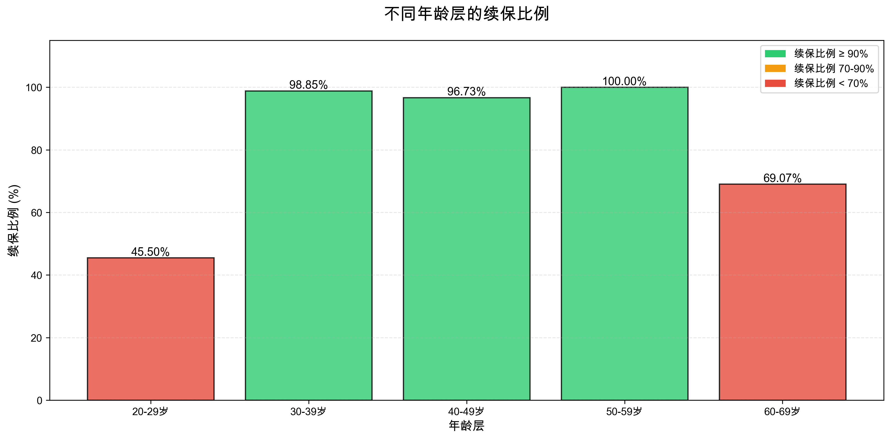

**核心发现**：
- **30-39岁**：续保率 **98.85%**（最高）
- **50-59岁**：续保率 **100%**（全部续保）
- **20-29岁**：续保率 **45.50%**（最低，流失风险高）
- **60-69岁**：续保率 **69.07%**（中等）

**业务洞察**：年轻客户（20-29岁）是重点流失群体，需要针对性营销策略。

#### 👥 续保分布分析

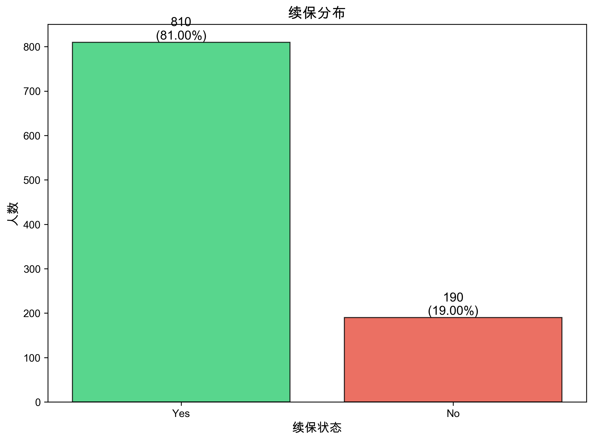

- **续保客户**：810人（81.00%）
- **不续保客户**：190人（19.00%）

#### 📊 年龄分布分析

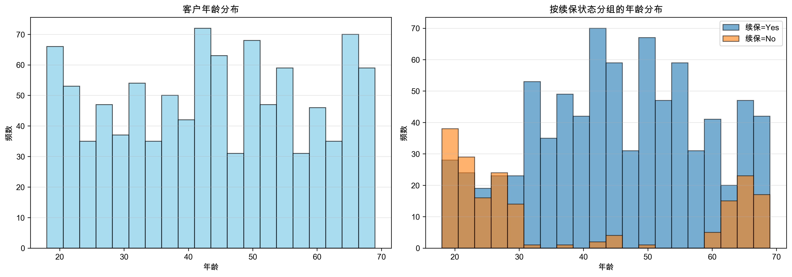

**统计特征**：
- 平均年龄：43.8岁
- 年龄范围：18-69岁
- 中位数：44岁

#### 💰 保费分析

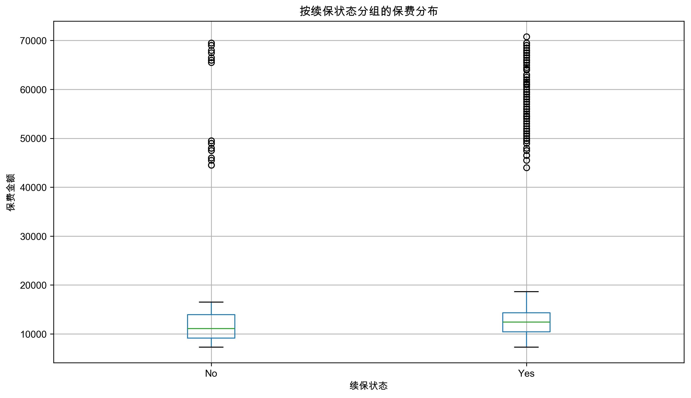

**关键发现**：
- 续保客户平均保费：**18,015元**
- 不续保客户平均保费：**16,647元**
- 保费差异：续保客户保费略高

#### 👫 性别分布

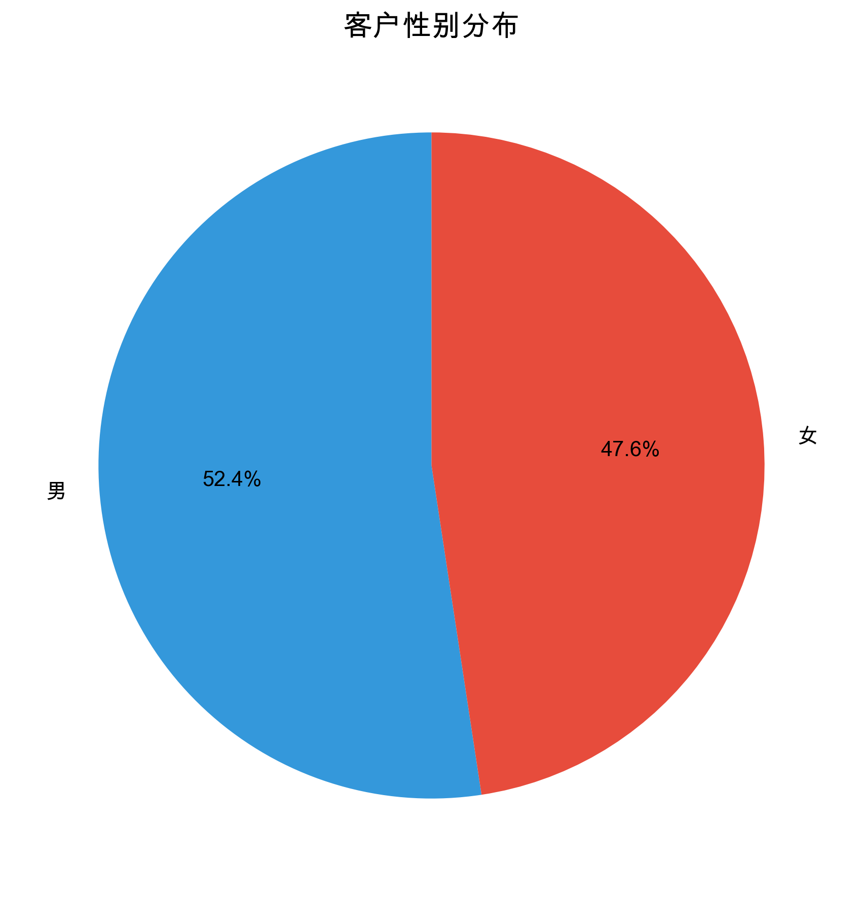

- **女性**：476人（47.6%），续保率 **85.08%**
- **男性**：524人（52.4%），续保率 **77.29%**

**洞察**：女性客户续保意愿更强。

---

## 🤖 模型性能

### 模型对比

| 模型 | 准确率 | ROC-AUC | 特点 | 适用场景 |
|------|--------|---------|------|----------|
| **逻辑回归** | 83.33% | - | 系数可解释，符合监管要求 | 需要强可解释性 |
| **决策树** | 91.33% | 0.9512 | 决策路径清晰，规则明确 | 需要规则解释 |
| **LightGBM（优化）** | **92.67%** | **0.9618** | **最高准确率，参数优化** | **生产环境推荐** |

### LightGBM模型详细性能

#### ROC曲线

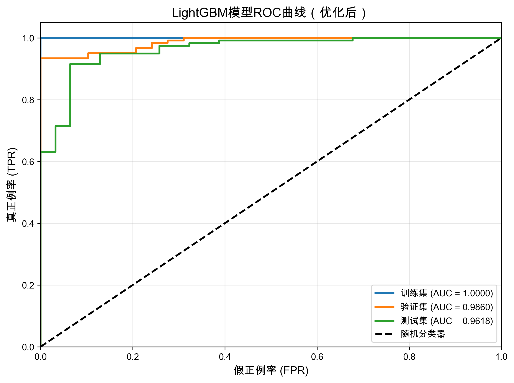

- **训练集AUC**：1.0000
- **验证集AUC**：0.9860
- **测试集AUC**：0.9618

#### 混淆矩阵

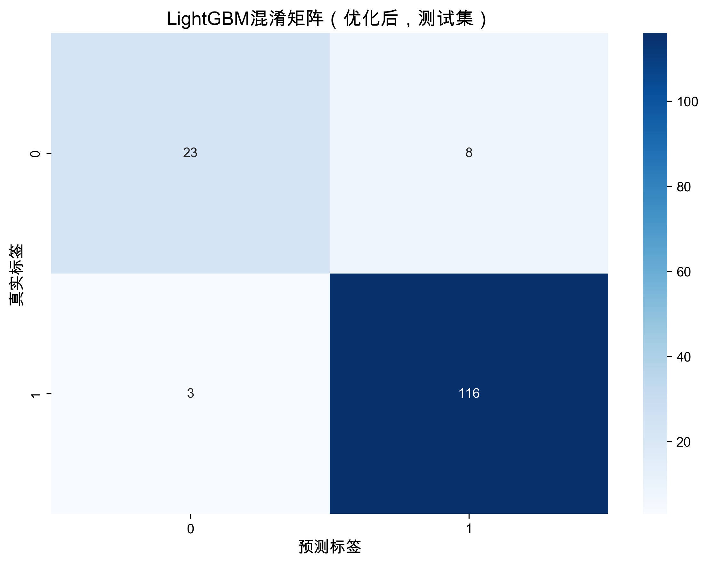

**测试集表现**：
- 真正例（TP）：116
- 真负例（TN）：23
- 假正例（FP）：8
- 假负例（FN）：3

**精确率**：93.55% | **召回率**：97.48% | **F1分数**：95.47%

#### 特征重要性

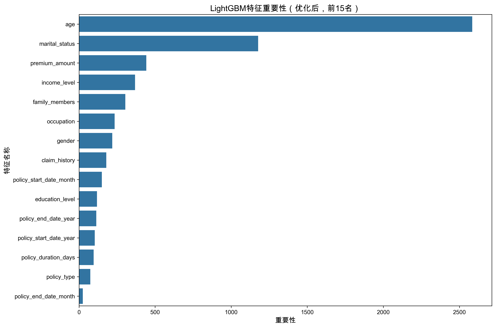

**Top 5 重要特征**：
1. **age（年龄）**：重要性 2584.07
2. **marital_status（婚姻状况）**：重要性 1177.23
3. **premium_amount（保费）**：重要性 442.50
4. **income_level（收入水平）**：重要性 367.98
5. **family_members（家庭成员数）**：重要性 303.88

#### 预测概率分布

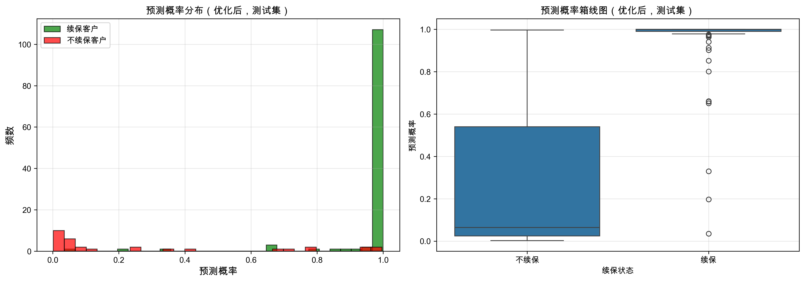

---

## 🔍 逻辑回归模型分析

### 系数可视化

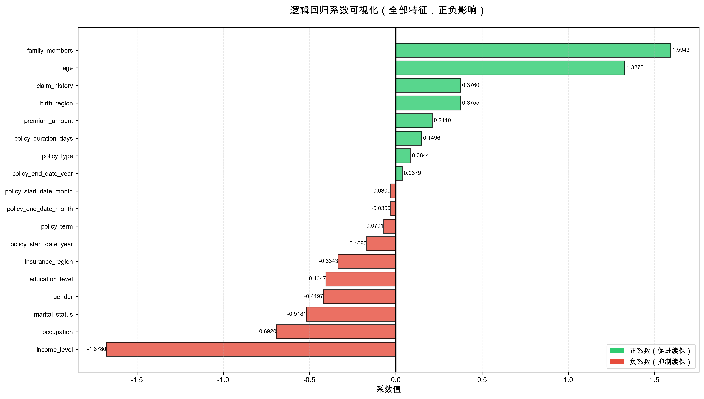

**关键系数**：
- **income_level**：-1.678（最强负向因子）
- **family_members**：+1.594（最强正向因子）
- **age**：+1.327（强正向因子）

### ROC曲线

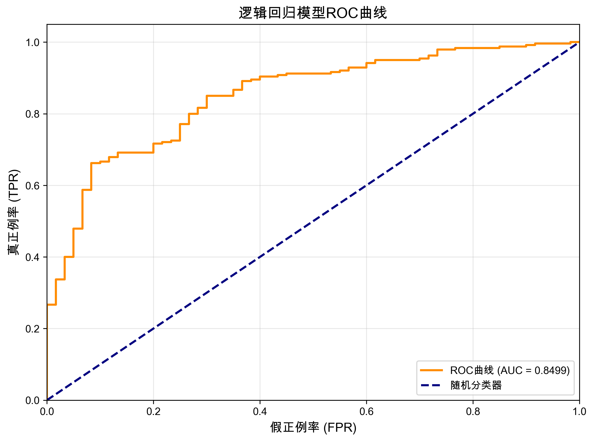

---

## 🌳 决策树模型分析

### 决策树可视化

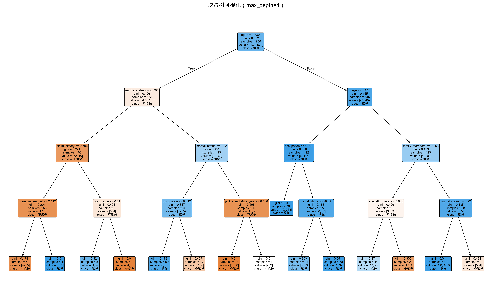

**关键决策路径**：
- 第一层分割：**age（年龄）**（重要性50.2%）
- 第二层分割：**marital_status（婚姻状况）**（重要性26.1%）

### 特征重要性

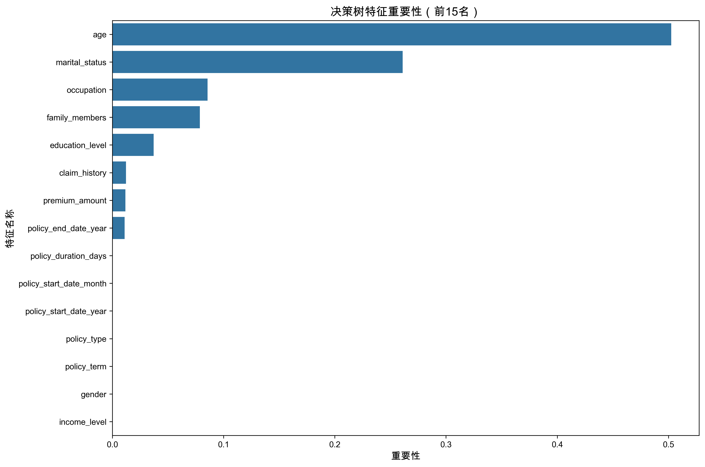

---

## 🎯 关键技术点

### 1. 数据预处理

```python
# 分类特征编码
- LabelEncoder：处理分类特征
- 日期特征工程：提取年、月、期限天数
- 缺失值处理：自动填充未知值
```

### 2. 模型优化技术

#### LightGBM参数优化

```python
最佳参数配置：
- num_leaves: 15          # 控制模型复杂度
- learning_rate: 0.05    # 学习率
- feature_fraction: 0.9  # 特征采样比例
- bagging_fraction: 0.8  # 样本采样比例
- min_data_in_leaf: 20   # 叶子节点最小样本数
- reg_alpha: 0.1         # L1正则化
- reg_lambda: 0.1        # L2正则化
```

**优化策略**：
- ✅ 网格搜索关键参数组合
- ✅ 早停机制防止过拟合
- ✅ 交叉验证评估泛化能力
- ✅ 正则化控制模型复杂度

### 3. 评分卡转换

**标准评分卡公式**：

```
Score = Base + Factor × ln(odds)
其中：
- Base = 600（基础分）
- Factor = PDO / ln(2) = 20 / ln(2) ≈ 28.85
- odds = p / (1-p)
```

**评分范围**：300-850分

**风险等级划分**：
- 🔴 **高风险**：< 500分
- 🟡 **中风险**：500-650分
- 🟢 **低风险**：650-800分
- 🟢 **极低风险**：800-850分

### 4. 特征工程

```python
# 日期特征提取
- policy_start_date_year
- policy_start_date_month
- policy_end_date_year
- policy_end_date_month
- policy_duration_days  # 保单期限（天数）

# 分类特征编码
- gender, birth_region, insurance_region
- income_level, education_level, occupation
- marital_status, policy_type, policy_term
- claim_history
```

### 5. 模型评估指标

- **准确率（Accuracy）**：整体预测正确率
- **ROC-AUC**：模型区分能力
- **精确率（Precision）**：预测为正例中真正例比例
- **召回率（Recall）**：真正例被正确预测的比例
- **F1分数**：精确率和召回率的调和平均

---

## 🚀 快速开始

### 环境要求

```bash
Python >= 3.9
pandas >= 1.3.0
numpy >= 1.21.0
scikit-learn >= 1.0.0
lightgbm >= 3.3.0
matplotlib >= 3.4.0
seaborn >= 0.11.0
```

### 安装依赖

```bash
pip install pandas numpy scikit-learn lightgbm matplotlib seaborn openpyxl
```

### 使用示例

#### 1. 单个样本预测

```python
from lgbm.task13_score_prediction_api import RenewalScorecard
import json

# 初始化评分卡
scorecard = RenewalScorecard(model_dir='lgbm')

# 准备请求数据
request_data = {
    "policy_id": 10001,
    "age": 56,
    "gender": "女",
    "birth_region": "黑龙江省",
    "insurance_region": "黑龙江省",
    "income_level": "高",
    "education_level": "本科",
    "occupation": "医生",
    "marital_status": "离异",
    "family_members": 5,
    "policy_type": "守护百分百2021",
    "policy_term": "20年",
    "premium_amount": 14931.0,
    "policy_start_date": "2019-08-27",
    "policy_end_date": "2039-08-27",
    "claim_history": "否"
}

# 预测
result = scorecard.predict_score(request_data)
print(result)
```

**输出示例**：
```
   renewal_probability  renewal_score  renewal_prediction risk_level  policy_id
0             0.999275     808.579698                   1       极低风险      10001
```

#### 2. 批量预测

```python
# 批量预测Excel文件
results = scorecard.batch_predict(
    file_path='policy_test.xlsx',
    output_path='prediction_results.xlsx'
)
```

#### 3. 运行完整流程

```bash
# 1. 数据探索
python task1_view_data.py
python task2_age_renewal_stats.py
python task3_age_renewal_chart.py
python task4_eda.py

# 2. 模型训练
python task5_logistic_regression.py
python task8_decision_tree.py
python lgbm/task12_lgbm_scorecard_v2.py

# 3. 预测接口测试
python lgbm/test_sample_request.py
```

---

## 📁 项目结构

```
insurance-renewal-prediction-ml/
├── 📊 数据文件
│   ├── policy_data.xlsx          # 训练数据（1000条）
│   └── policy_test.xlsx          # 测试数据（200条）
│
├── 🔍 数据分析脚本
│   ├── task1_view_data.py        # 数据查看
│   ├── task2_age_renewal_stats.py # 年龄层统计
│   ├── task3_age_renewal_chart.py # 年龄层可视化
│   └── task4_eda.py              # 探索性数据分析
│
├── 🤖 模型训练脚本
│   ├── task5_logistic_regression.py  # 逻辑回归模型
│   ├── task8_decision_tree.py       # 决策树模型
│   └── lgbm/
│       ├── task12_lgbm_scorecard.py      # LightGBM初始版
│       ├── task12_lgbm_scorecard_v2.py   # LightGBM优化版
│       └── task13_score_prediction_api.py # 预测接口
│
├── 📈 可视化结果
│   ├── age_renewal_rate_chart.png      # 年龄层续保比例
│   ├── eda_*.png                        # EDA分析图表
│   ├── lr_*.png                         # 逻辑回归图表
│   ├── decision_tree_*.png              # 决策树图表
│   └── lgbm/
│       └── lgbm_*_optimized.png         # LightGBM优化图表
│
├── 📄 分析报告
│   ├── logistic_regression_interpretation.md  # 逻辑回归解释
│   ├── decision_tree_interpretation.md        # 决策树解释
│   └── scorecard_model_selection.md           # 模型选型方案
│
└── 📋 项目文档
    ├── README.md                    # 项目说明（本文件）
    └── checklist.md                 # 任务清单
```

---

## 💡 业务洞察

### 续保人群画像

**高续保概率客户特征**：
- ✅ 年龄：30-55岁（中年客户）
- ✅ 婚姻状况：已婚
- ✅ 家庭成员：3-6人
- ✅ 收入水平：中高收入
- ✅ 理赔历史：有理赔经历
- ✅ 保费金额：较高

### 不续保人群画像

**低续保概率客户特征**：
- ❌ 年龄：20-30岁（年轻客户）
- ❌ 婚姻状况：单身
- ❌ 家庭成员：1-2人
- ❌ 收入水平：低收入
- ❌ 理赔历史：无理赔经历
- ❌ 保费金额：较低

### 营销建议

1. **针对年轻单身客户**：开发低门槛产品，提供分期付款
2. **针对低收入客户**：推出特价优惠，强调保障价值
3. **维护高价值客户**：提供VIP服务，定期关怀
4. **提前预警**：使用模型提前3-6个月识别流失风险

---

## 📊 模型性能总结

### 最终模型（LightGBM优化版）

| 指标 | 训练集 | 验证集 | 测试集 |
|------|--------|--------|--------|
| **准确率** | 100.00% | 93.33% | **92.67%** |
| **ROC-AUC** | 1.0000 | 0.9860 | **0.9618** |
| **精确率** | - | - | 93.55% |
| **召回率** | - | - | 97.48% |
| **F1分数** | - | - | 95.47% |

### 过拟合分析

- **训练集-测试集差异**：7.33%
- **评估**：轻微过拟合，模型泛化能力良好 ✅

---

## 🔧 技术栈

- **编程语言**：Python 3.9+
- **数据处理**：pandas, numpy
- **机器学习**：scikit-learn, LightGBM
- **可视化**：matplotlib, seaborn
- **模型部署**：pickle, json

---

## 📝 许可证

MIT License

---

## 👥 贡献

欢迎提交Issue和Pull Request！

---

<div align="center">

**⭐ 如果这个项目对你有帮助，请给个Star！⭐**

Made with ❤️ by Data Science Team

</div>
